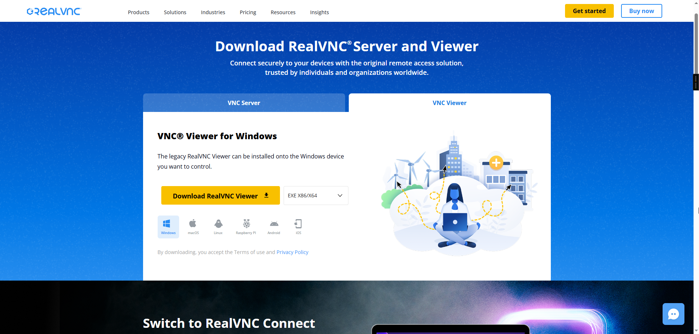
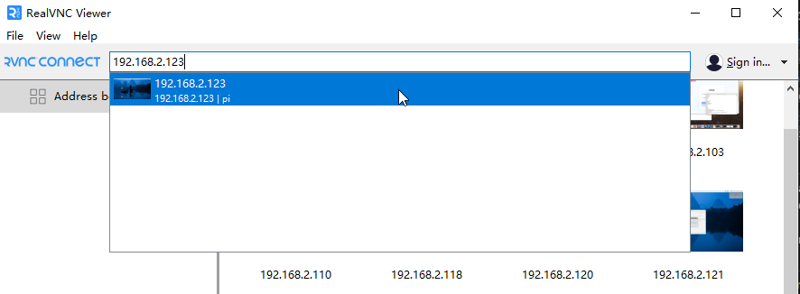

.. _assembly_tutorial:

1. Hardware Setup
=================

This section guides you through the hardware assembly process for the M.2 NVMe SSD adapter.

You can refer to the video tutorial below. Please follow the steps in the video to install your M.2 NVMe SSD adapter:

.. raw:: html
   
   <iframe width="650" height="400" src="https://www.youtube.com/embed/IaQ3wGXngcE?si=AitTcwl2qR4YBx62"  title="LAFVIN M.2 NVMe SSD Adapter For RPI5 Installation Demonstration Video" frameborder="0" allow="accelerometer; autoplay; clipboard-write; encrypted-media; gyroscope; picture-in-picture; web-share" referrerpolicy="strict-origin-when-cross-origin" allowfullscreen></iframe>

Install VNC Viewer Software
-------------------------------
Please visit the official RealVNC website below to download and install the VNC Viewer client according to your operating system:

`Download VNC Viewer <https://www.realvnc.com/en/connect/download/viewer/>`_

After downloading, follow the installation wizard to complete the setup. Then, launch VNC Viewer, enter your Raspberry Pi's IP address, and click the connect button.

.. note::
   You need to know the IP address of the Raspberry PI to connect through VNC. Usually, you can use the 'ping-4 raspberrypi.local' command in the command line or terminal of your computer, or find the IP address by checking the list of connected devices on your router. Also, please ensure that you have enabled the VNC server on the Raspberry PI (this can be done by running 'sudo raspi-config' 'and then selecting Interface Options -> VNC -> Yes).

