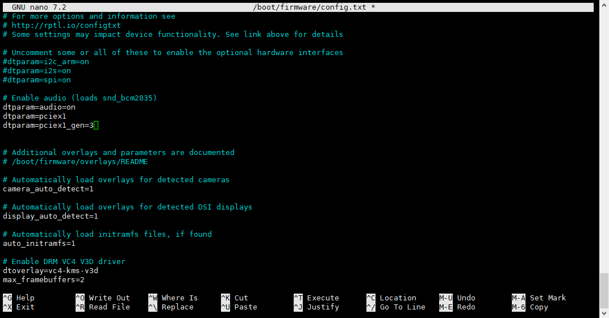

2. Using SSD as Expanded Storage (SD Card + SSD)
=================================================
This chapter will guide you on how to configure an M.2 NVMe SSD as expanded storage for your Raspberry Pi 5 (meaning the system still runs on the SD card, and the SSD is used for storing data).

First, log in to your Raspberry Pi 5 system via SSH or by directly connecting a keyboard and monitor.

**Step 1: Modify Boot Configuration**
-----------------------------------------
#. Edit the ``/boot/firmware/config.txt`` file. Using the ``nano`` editor is recommended:

   .. code-block:: bash

      sudo nano /boot/firmware/config.txt

#. Add the following two lines at the end of the file:

   .. code-block:: none

      dtparam=pciex1
      dtparam=pciex1_gen=3

#. Press ``Ctrl+X``, then ``Y``, and finally ``Enter`` to save and exit the editor.

**Step 2: Install Hardware**
-------------------------------
#. Power off the Raspberry Pi 5.
#. Following the instructions for your M.2 adapter, correctly install your NVMe SSD onto the M.2 adapter.

**Step 3: Check SSD Recognition**
-----------------------------------
#. Reconnect the power and boot up the Raspberry Pi 5.
#. Open a terminal and execute the following commands to check the PCI-E devices and block device list, confirming if your SSD is recognized by the system:

   .. code-block:: bash

      lspci
      lsblk

#. You should see information similar to ``NVMe SSD`` or the specific model name, along with a new block device (e.g., ``/dev/nvme0n1``).

   .. image:: img/2.1.png

   .. image:: img/2.2.png

**Step 4: Format the SSD**
------------------------------
#. Use the ``mkfs.ext4`` command to format the SSD with the ext4 filesystem. **Please replace ``/dev/nvme0n1`` with the actual device name you identified in the previous step**.

   .. warning::
      Formatting will erase all data on the SSD. Proceed with caution!

   .. code-block:: bash

      sudo mkfs.ext4 /dev/nvme0n1

   The system might prompt you about detecting a partition table; type ``y`` and press ``Enter`` to continue.

#. After formatting is complete, use ``lsblk`` again to confirm the device status.

   .. code-block:: bash

      lsblk

   Now, ``/dev/nvme0n1`` should no longer have an associated mount point.

**Step 5: Mount the SSD**
-----------------------------
#. Create a directory to serve as the mount point for the SSD. For example, create a directory named ``SSD`` in the user's home directory:

   .. code-block:: bash

      mkdir ~/SSD

#. Manually mount the SSD to this directory:

   .. code-block:: bash

      sudo mount /dev/nvme0n1 ~/SSD

#. To make the system automatically mount the SSD on every boot, you need to edit the ``/etc/fstab`` file:

   .. code-block:: bash

      sudo nano /etc/fstab

#. Add the following line at the end of the file. **Again, be sure to replace the device name and mount path with your actual names**:

   .. code-block:: none

      /dev/nvme0n1 /home/pi/SSD ext4 defaults 0 0

   This assumes your username is ``pi`` and the mount point is ``/home/pi/SSD``. Modify according to your actual setup.

#. Press ``Ctrl+X``, ``Y``, ``Enter`` to save and exit.

   .. image:: img/4.png

#. Execute the following command to apply the mount, or simply reboot the Raspberry Pi:

   .. code-block:: bash

      sudo mount -a

#. After rebooting, you can use the ``df -h`` command to check if the SSD is successfully mounted:

   .. code-block:: bash

      df -h

   You should see ``/dev/nvme0n1`` mounted at ``/home/pi/SSD``.

   .. image:: img/6.png

**Step 6: (Optional) Test Read/Write Speed**
-----------------------------------------------
#. To get more accurate test results, you can first clear the filesystem cache:

   .. code-block:: bash

      sudo sh -c "sync && echo 3 > /proc/sys/vm/drop_caches"

#. Test write speed (writes an approximately 2GB file):

   .. code-block:: bash

      sudo dd if=/dev/zero of=~/SSD/test_write bs=1M count=2000 status=progress

#. Test read speed (reads the file just written):

   .. code-block:: bash

      sudo dd if=~/SSD/test_write of=/dev/null bs=1M status=progress

#. After testing, delete the test file:

   .. code-block:: bash

      rm ~/SSD/test_write

.. note::
   Read/write speeds are affected by various factors like the SSD model, Raspberry Pi load, etc. The test results are for reference only.

At this point, you have successfully configured the M.2 NVMe SSD as expanded storage for your Raspberry Pi 5.
