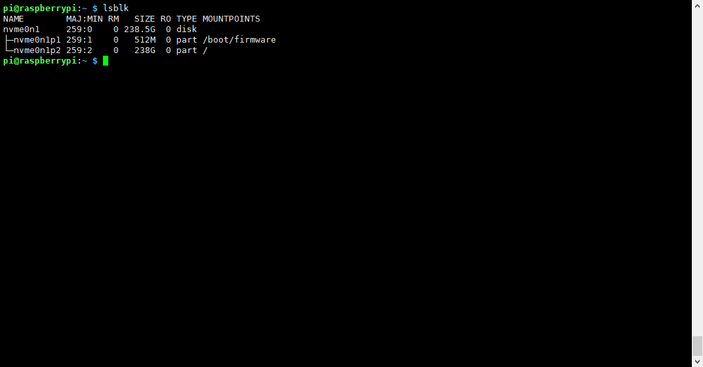

3. Using SSD as the System Disk
===================================
This chapter will guide you on how to configure an M.2 NVMe SSD as the primary system disk for your Raspberry Pi 5, enabling you to boot and run the system from the SSD.

.. important::
   Before starting, ensure you have completed **Steps 1 through 4** from the previous chapter **"2. Using SSD as Expanded Storage (SD Card + SSD)"**, including:
   * Modifying the boot configuration (``/boot/firmware/config.txt``)
   * Correctly installing the M.2 adapter and SSD
   * Confirming the system recognizes the SSD (using ``lspci`` and ``lsblk``)
   * Formatting the SSD with the ext4 filesystem (using ``mkfs.ext4``)

   **Do not perform Step 5 (Mounting the SSD) or Step 6 (Testing Speed) from the previous chapter.**

**Step 1: Enable and Connect VNC**
------------------------------------
#. If you haven't enabled the VNC server yet, enable it via ``raspi-config`` or the desktop environment's settings.
   * Enter ``sudo raspi-config`` in the terminal
   * Select ``Interface Options`` -> ``VNC`` -> ``Yes``.
#. Using a VNC Viewer client or similar software, connect to the Raspberry Pi's desktop environment from your computer.

   .. image:: img/20.png

   .. image:: img/21.png

**Step 2: Copy the System using SD Card Copier**
---------------------------------------------------
#. In the Raspberry Pi's desktop environment, find and open the "SD Card Copier" tool (usually under the "Accessories" menu).
#. In the "Copy From Device" dropdown menu, select your SD card device (usually ``/dev/mmcblk0``).
#. In the "Copy To Device" dropdown menu, select your NVMe SSD device (e.g., ``/dev/nvme0n1``).
#. **Make sure to check the "New Partition UUIDs"** option. This is crucial to avoid partition UUID conflicts during boot.
#. Click the "Start" button to begin the copying process. This may take some time, depending on the size and speed of your SD card.

   .. image:: img/22.png
      :alt: SD Card Copier - Select Source Device (SD Card)
   .. image:: img/23.png
      :alt: SD Card Copier - Select Target Device (SSD) and check New Partition UUIDs
   .. image:: img/24.png
      :alt: SD Card Copier - Start Copying

#. Wait for the copy process to complete.

**Step 3: Modify EEPROM Boot Configuration**
---------------------------------------------
#. After the copy is complete, maintain the VNC connection or switch back to an SSH terminal.
#. Execute the following command to edit the EEPROM configuration:

   .. code-block:: bash

      sudo rpi-eeprom-config --edit

#. Check the file content and ensure it includes the following two lines. If they don't exist, add them:

   .. code-block:: none

      PCIE_PROBE=1
      BOOT_ORDER=0xf416

   * ``PCIE_PROBE=1`` ensures PCIe devices are probed at boot.
   * ``BOOT_ORDER=0xf416`` sets the boot order: Try NVMe SSD (``6``) first, then SD card (``1``), then USB (``4``), and finally network boot (``f``) if all else fails.

   .. image:: img/25.png
      :alt: Edit EEPROM Configuration
   .. image:: img/26.png
      :alt: Example EEPROM Configuration Content (including PCIE_PROBE and BOOT_ORDER)

#. Press ``Ctrl+X``, then ``Y``, and finally ``Enter`` to save and exit.

**Step 4: Boot from SSD**
----------------------------
#. Power off the Raspberry Pi 5.
#. **Remove the SD card**.
#. Reconnect the power.

The Raspberry Pi should now attempt to boot from the NVMe SSD. If everything is successful, the system will load and run from the SSD. You can confirm if the root filesystem (``/``) is on the NVMe device (e.g., ``/dev/nvme0n1p2``) using the ``lsblk`` or ``df -h`` command.

.. note::
   If you encounter boot issues, you can try reinserting the SD card to check the EEPROM configuration and the filesystem on the SSD.