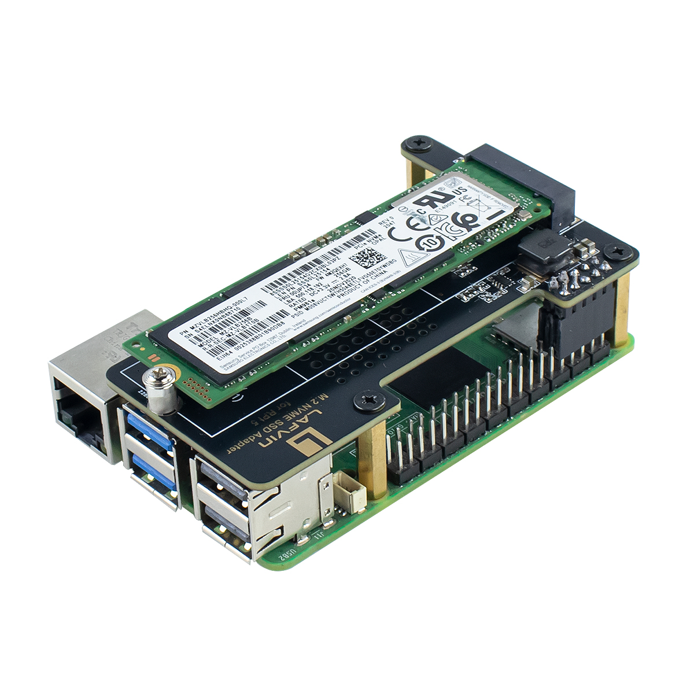
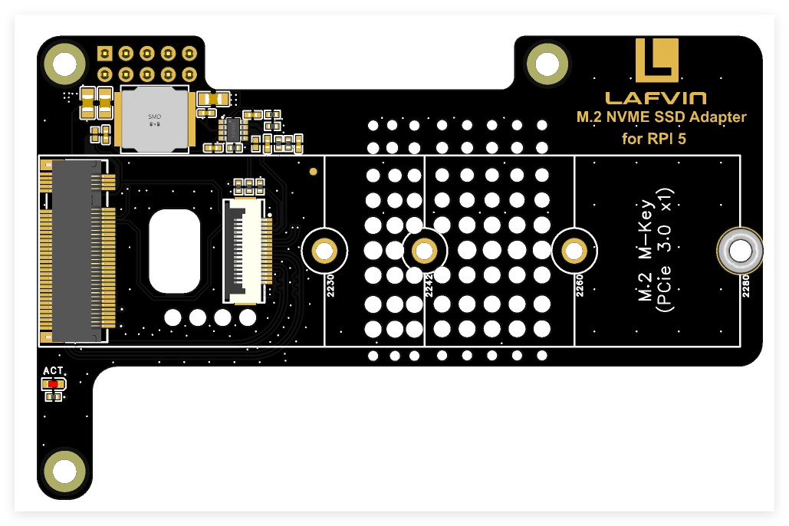
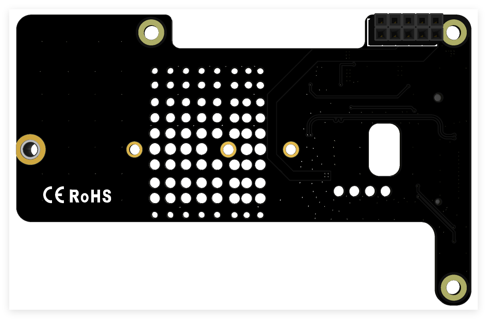
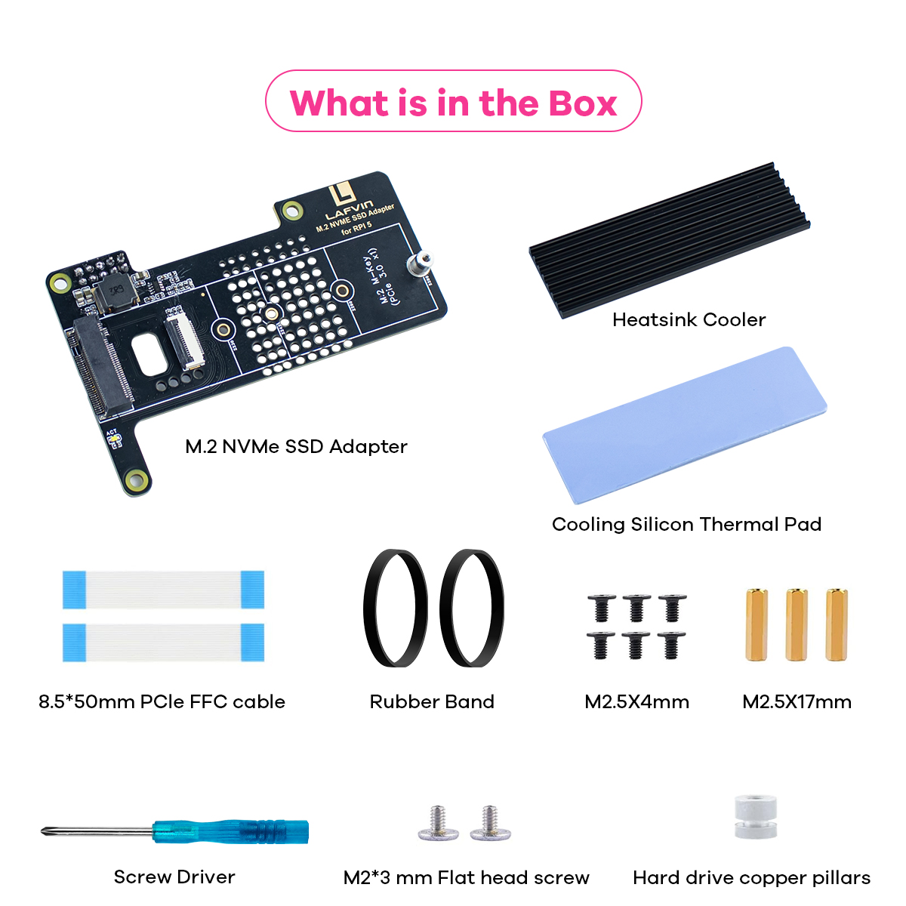

.. _about-this-kit:

===============
About This Kit
================

------------------------------------
LAFVIN M.2 NVMe SSD Adapter For RPI5
------------------------------------

   *LAFVIN M.2 NVMe SSD Adapter*

Introduction
============

The N04 is an NVMe M.2 SSD PCIe peripheral board (PIP) designed specifically for the Raspberry Pi 5. It utilizes the Pi 5's PCIe interface to connect NVMe M.2 SSDs (compatible with 2230, 2242, 2260, 2280 sizes, supporting PCIe Gen3), enabling rapid data transfer and high-speed system booting.

The N04 board conforms to the standard Raspberry Pi HAT dimensions and supports the four common NVMe SSD sizes: 2230, 2242, 2260, and 2280. The kit includes SSD mounting screws, allowing users to easily install different SSD sizes as needed.

Features
========

.. _key-features:

* **Designed for Raspberry Pi 5:** Perfectly tailored for the latest Raspberry Pi 5 single-board computer.
* **NVMe Support:** Supports installation of M Key and B+M Key M.2 NVMe SSDs in 2230, 2242, 2260, and 2280 formats. Includes custom CNC SSD mounting screws, no soldering required.
* **PCIe Support:** Supports PCIe x1 interface, compatible with both Gen2 and Gen3 standards.
* **Optimized Cooling:** On-board ventilation holes facilitate airflow, enhancing heat dissipation.
* **Camera/Display FPC Cutouts:** Openings are reserved on the PCB to allow routing for two display or camera FPC cables.
* **Gold-Plated PCB:** Manufactured using an immersion gold process for superior electrical performance and durability.
* **Ultra-Short PCIe Traces:** Optimized short PCIe signal routing ensures more reliable and faster transmission, fully meeting PCIe Gen3 signal requirements.
* **LED Indicator:** Features an onboard LED indicator ("ACT") for M.2 SSD activity status.
* **M.2 Standard Power System:** Integrates an efficient voltage regulator providing up to 3A for the 3.3V power rail, compliant with M.2 (NGFF) power specifications.
* **All Necessary Accessories Included:** The kit contains an FPC PCIe ribbon cable, M2 and M2.5 screws, standoffs, SSD mounting standoffs, and an M.2 SSD heatsink kit including a heatsink and thermal pad.

Application Scenarios
=====================

.. _applications:

* **Expanded Storage:** Provide your Raspberry Pi with high-speed, large-capacity additional storage space.
* **System Boot Disk:** Use the SSD as the primary system disk for your Raspberry Pi 5 to experience ultra-fast boot times and responsiveness.

.. note::
   The kit includes all necessary accessories **except** for the Raspberry Pi 5 board, SD card, and M.2 NVMe SSD itself.